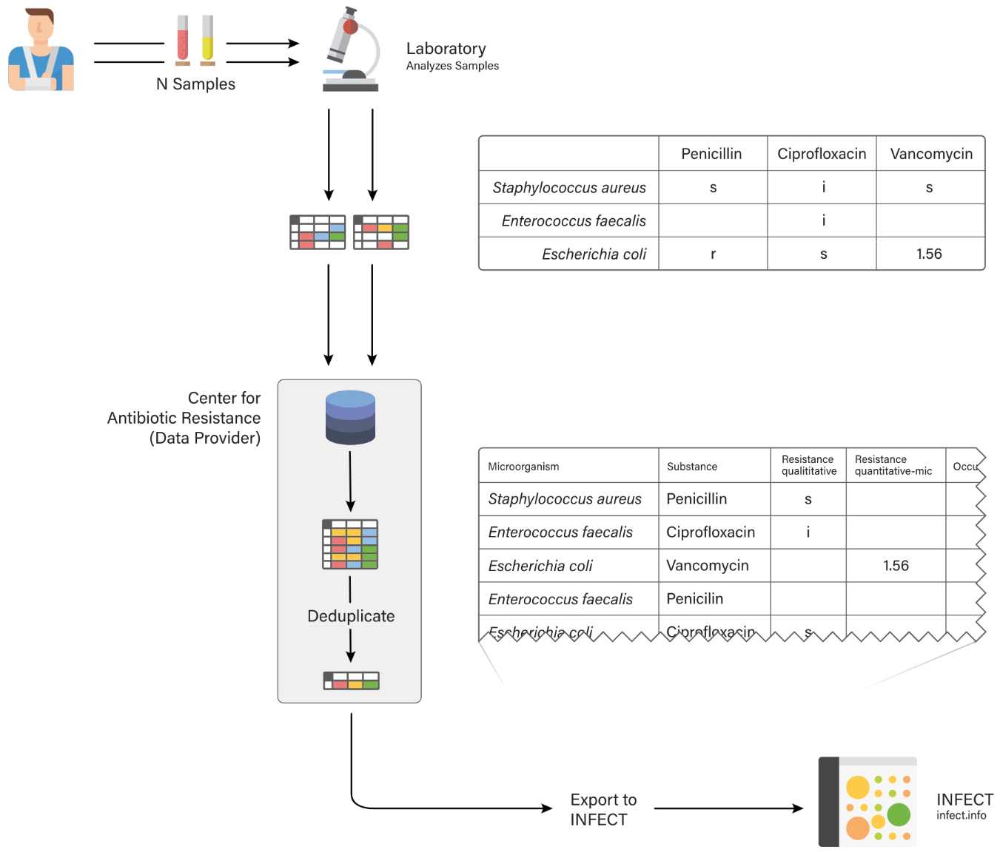

# Specification Data Exchange Format for INFECT

This document defines the format in which data is transferred to INFECT from external sources.

**Specification Version:** 3.0.0
 
**Date:** 2020-10-10

## Contents

- <a href="#file-format">**File Format**</a>
- <a href="#data-flow">**Data Flow**</a>
- <a href="#definitions">**Definitions**</a>
- <a href="#required-columns">**Required Columns**</a>
    - <a href="#unique-identifier">Unique Identifier</a>
    - <a href="#microorganism">Microorganism</a>
    - <a href="#substance">Substance</a>
    - <a href="#resistance">Resistance</a>
    - <a href="#country">Country</a>
- <a href="#optional-columns">**Optional Columns**</a>
    - <a href="#patient-age">Patient Age</a>
    - <a href="#sample-source">Sample Source</a>
    - <a href="#patient-setting">Patient Setting</a>
    - <a href="#reggion">Region</a>
    - <a href="#microorganism-strain">Microorganism Strain</a>
    - <a href="#animal">Animal</a>
    - <a href="#microorganism-strain">Patient Setting</a>
    - <a href="#sample-collection-date">Sample Collection Date</a>
    - <a href="#resistance-mechanism">Resistance Mechanism</a>
    - <a href="#laboratory-identifier">Laboratory Identifier</a>
    - <a href="#institution-identifier">Institution Identifier</a>
    - <a href="#is-nosocomial">Is Nosocomial</a>
    - <a href="#is-screening">Is Screening</a>
- <a href="#changelog">**Changelog**</a>

## File Format

The data is transferred in
 the form of a CSV file (RFC 4180 format). Each row contains one record, defined as one combination of a microorganism and its resistance for one substance in one patient, tested by one laboratory for one deduplicated sample (in one infection episode).

Data can be sent to INFECT in any time interval. Overlapping data sets can be imported by INFECT (INFECT will identify records using the unique-identifier and remove any duplicates). The CSV files must be uploaded to a prespecified SFTP-server from where they will be automatically imported into INFECT.

## Data Flow
The image below shows how the data flows from the patient to INFECT and how it is transformed in this process.

## Definitions

- **Sample**: The actual tissue / blood etc. obtained from a patient, that is analysed (e.g. a test tubes containing blood, urine or a tissue sample). Multiple samples can be taken from one patient at the same time.
- **Patient**: A human or an animal who has a sample taken for analysis.
- **Laboratory**: An institution that tests samples obtained from patients.
- **Sample-Data**: The set of **one microorganism and all substance resistance data** obtained from **one** sample.
- **Microorganism**: The pathogen assumed to cause an infection in a patient, or the organism found in a screening test.
- **Episode**: An episode of infection is defined as the timespan from the start of the infection to its end, caused by the microorganism(s) detected in at least one sample. The possibility of relapses is not evaluated during import.
- **Deduplicated Sample-Data**: Deduplicated sample-data represents the aggregated data of all sample-data obtained for one episode with one microorganism of one patient in one laboratory
- **Occurrence Number**: The numerical identifier of microorganism strains in case of several microorganisms of the same species in one set of  Deduplicated Sample-Data.
- **Resistance**: Represents the level of in-vitro activity of one substance against one microorganism.
- **Test**: One test represents the resistance result of one sample for one substance against one microorganism.
- **Record**: A record contains the data of deduplicated sample-data for one microorganism (per occurrence number) and one substance.
- **Column**: The contents of one column of the CSV file sent to INFECT.
- **Data Provider**: The institution that delivers CSV files to the INFECT application.
- **Not Available**: Defines the absence of a value. The data is not available to the data provider. Delivered as an empty value “” (empty string) in the CSV file.
- **Not Delivered**: Defines that a value exists, but is not delivered to INFECT because it is optional and the data provider chose not to deliver the values for that column (e.g., because it is not meant to be used by INFECT). Delivered as the value “-” in the CSV file.
- **Not Specified**: Defines that a value exists, but is not available or not meaningful in a high resolution. Delivered as the value “other” in the CSV file.

## Required Columns
### Unique Identifier
The identifier can either be a ***generated unique value*** which is always the same for a given record delivered to INFECT **or** a **derived unique value**, which is created using a hash function over the essential columns of a record (see below). 

- **Column Name**: unique-identifier
- **Required**: True
- **Description**: Used to uniquely identify each record and to ensure each record is only imported once into INFECT, even if the same data is sent multiple times.

#### Variant: *Generated Unique Value*
- **Format**: Universally unique identifier (UUID) V4 (128 bits, hex encoded, separated by dash characters. Total string length of 36 characters.)
- **Description**: A random identifier not changing over time for the same record. Only needed if no derived unique identifier is available.
- **Example**: `eb43ea98-43f7-4f21-a128-ccda382ded25`

#### Variant: *Derived Value (Hash Function)*
- **Format**: MD5 Hash (128 bits, hex encoded, string length of 32 characters.)
- **Description**: MD5 Hash over the columns listed below. None of the values can be null or empty, the order of the columns passed to the hash function must always be the same. The data must have the format as defined in the definitions (record). Only needed if no generated unique identifier is available.
    
    - substance
    - microorganism
    - occurence number
    - laboratory-identifier
    - patient-identifier
    - sample-collection-date

- **Pseudo Code**: `unique-identifier = MD5(substance, microorganism, occurence number, laboratory-identifier, patient-identifier, sample-collection-date);`
- **Example**: `A2E1748A89C61B117C5E4947E0B90647`

### microorganism

- **Column Name**: microorganism
- **Format**: String, characters [a-z0-9 -_] max length: 100 characters. Values can freely be defined, but must be unique and remain constant for the same microorganism over time. The name should consist of the genus+species, so that the uniqueness is guaranteed.
- **Description**:  Defines which microorganism was tested. The values are mapped to the microorganisms stored in the INFECT database. If microorganism codes or IDs are used, an additional codebook sheet that identifies genus and species of each microorganism is required. We strongly recommend using a genus-species format instead of codes.
- **Required**: True
- **Example**: `staphylococcus-aureus`

### Substance

- **Column Name**: substance
- **Format**: String, characters [a-z0-9 -_] max length: 100 characters. Values can freely be defined, but must be unique and remain constant for the same substance over time.
- **Description**:  Defines which substance was tested. The values are mapped to the substances stored in the INFECT database. If substance codes or IDs are used, an additional codebook sheet that identifies the full name of the substance is required. We strongly recommend using a full substance name format instead of codes.
- **Required**: True
- **Example**: `ceftriaxone`

### Resistance
Resistance values can be delivered as qualitative, quantitative or genotype resistance. At least one of the three values must be delivered. Records missing all three values are rejected. If multiple resistance data is provided, only the most precise value (according to the order of the columns below) will be used in INFECT.

#### Variant *Qualitative*
- **Column Name**: resistance-qualitative
- **Format**: String, one of the following values (exact match): r, i, s
- **Description**:  Must be interpreted results with qualitative resistance data for each sample (i.e., r = resistant, i = increased exposure [formerly intermediate], s = susceptible). If other resistance measures are also delivered, this is the one that will be primarily shown in INFECT.
- **Required**: False, each record must contain at least one of the resistance measures.
- **Example**: `s`; `i`; `r`

#### Variant *Genotype*
- **Column Name**: resistance-genotype
- **Format**: String, one of the following values (exact match): r, i, s
- **Description**:  Result of genotypic determination of antimicrobial resistance (i.e., r = resistant, i = increased exposure [formerly intermediate], s = susceptible). Will only be shown when no value for resistance-qualitative is available.
- **Required**: False, each record must contain at least one of the resistance measures
- **Example**: `s`; `i`; `r`

#### Variant *Quantitative Mic*
- **Column Name**: resistance-quantitative-mic
- **Format**: Decimal(10, 5) (xxxxx.yyyyy; i.e. up to 5 digits before and after the decimal point), must be a positive number describing the minimum inhibitory concentration (MIC). Use the highest number in range for values higher than a certain number (e.g. 500 for >500)
- **Description**:  Optional data if available; the quantitative resistance of antimicrobial susceptibility testing given as MIC.
- **Required**: False, each record must contain at least one of the resistance measures
- **Example**: `0.003`; `1.2`; `500`

#### Variant *Disc Diffusion*
- **Column Name**: resistance-quantitative-disc-diffusion
- **Format**: Decimal(10, 5) (xxxxx.yyyyy; i.e. up to 5 digits before and after the decimal point), must be a positive number describing the minimum inhibitory concentration (MIC). Use the highest number in range for values higher than a certain number (e.g. 500 for >500)
- **Description**:  Optional data if available; the quantitative resistance of antimicrobial susceptibility tested using disc diffusion.
- **Required**: False, each record must contain at least one of the resistance measures
- **Example**: `0.003`; `1.2`; `500`

### Country

- **Column Name**: country
- **Format**: ISO 3166-1 alpha-3 format, Upper Case
- **Description**:  Defines the country where the sample was taken
- **Required**: True
- **Example**: `CHE`

## Optional Columns

### Patient Age
The patients age can either be specified as a **single age value** or an **age range** consisting of two values. It is highly recommended to deliver the most specific value for each record (which is the exact age). The age is categorized into age groups for the INFECT user interface on the fly by the INFECT Real-time Data Analytics Service (RDA).

- **Format**: String: value+unit, age in days, weeks, months or years (1d = age of one day, 24m = age of 24 months, 35y = age of 35 years. Compound values consisting of multiple units are not supported (e.g. 23y3m is not a valid value).
- **Description**:  Patient age at the time of sampling.
- **Required**: False
- **Example**: `5d`; `10m`; `65y`; `-`;  ` `

#### Variant *Single Age Value*
- **Column Name**: patient-age

#### Variant *Age Range*
- **Column Name**: patient-age-range-from
- **Column Name**: patient-age-range-to

## Sample Source
The sample source of a record describes from which organ / place the sample was taken. Since a record can be a deduplicated representation/aggregation of many individual samples, many sample sources can be present for one record. The data displayed in INFECT can be assigned to a sample source which may be selected by the user in the INFECT user interface to filter the data. Sample sources are freely definable (they can however **not** contain the character `;`), but not changeable after they were initially defined since the existing data in the caches of INFECT would have to change too, which is currently not possible. The values sent to INFECT are identifiers which later are mapped to translatable labels in the INFECT configuration. The field may contain multiple sample source identifiers separated by semicolons.

- **Required**: False
- **Example**: `blood`;`blood;urine`; `-`;  ` `

## Patient Setting
- **Column Name**: patient-setting
- **Format**: String, must be one of the following values (exact match): inpatient, outpatient, icu, long term facility, other.
- **Description**:  Describes the location / situation where the sample was taken. Only the values defined above are accepted as input.
- **Required**: False
- **Example**: `inpatient`; `outpatient`; `-`;  ` `

## Region
- **Column Name**: region
- **Format**: String, characters [a-z0-9 -_] max length: 100 characters.
- **Description**:  The data displayed in INFECT must be assigned to regions which may be selected by the user in the INFECT user interface to filter the data. Regions are freely definable, but not changeable after they were initially defined since the existing data in the caches of INFECT would have to change too, which is currently not possible. The values sent to INFECT are identifiers which later are mapped to translatable labels in the INFECT configuration.
- **Required**: False
- **Example**: `central-west-switzerland`; `-`;  ` `

## Microorganism Strain
- **Column Name**: microorganism-strain
- **Format**: String, characters [a-z0-9 -_] max length: 100 characters. Values can freely be defined, but must remain constant for the same microorganism strain over time.
- **Description**:  Defines the microorganism strain, serotype or sequence type (or other typing).
- **Required**: False
- **Example**: `ST796`; `JE2`; `-`;  ` `

## Animal
- **Column Name**: animal
- **Format**: String, characters [a-z0-9 -_] max length: 50 characters. Optional; only for veterinary data; required  for veterinary data. Values can freely be defined, but must be unique and remain constant for the same animal over time.
- **Description**:  Defines from which animal the sample was taken. The values are mapped to the animals stored in the INFECT database. If human and animal data are mixed in one set, classify human data as animal: human.
- **Required**: False
- **Example**: `sheep`; `cattle`; `-`;  ` `

## Patient Sex
- **Column Name**: patient-sex
- **Format**: String, one of the following values (exact match): m, f, m-neutered, f-neutered, other.
- **Description**:  Defines the sex of the patient from whom the sample has been drawn. 
- **Required**: False
- **Example**: `f`; `m`; `other`;  `-`;  ` `

## Sample Collection Date
- **Column Name**: sample-collection-date
- **Format**: String, ISO 8601 Format (yyyy-mm-dd).
- **Description**:  Sample collection date. If this is not available, then alternatively the first lab registration date can be given. 
- **Required**: False
- **Example**: `2019-04-01`;  `-`;  ` `

## Resistance Mechanism
- **Column Name**: resistance-mechanism
- **Format**: String, characters [a-z0-9 -_] max length: 50 characters. Values can freely be defined, but must be unique and remain constant for the same substance over time.
- **Description**:  Defines a specific known resistance mechanism. 
- **Required**: False
- **Example**: `meca`;  `vanb`;  `ampc`;  `-`;  ` `

## Laboratory Identifier
- **Column Name**: laboratory-identifier
- **Format**: String, characters [a-z0-9 -_] max length: 50 characters. 
- **Description**:  Optional identifier of the lab that has processed the sample. This will not be shown in INFECT as a filter, but can be used for automated data validation (e.g. detection of clusters of missing or bad data).
- **Required**: False
- **Example**: `B2E1748A89C61B117C5E4947E0B90647`;  `-`;  ` `

## Institution Identifier
- **Column Name**: institution-identifier
- **Format**: String, characters [a-z0-9 -_] max length: 50 characters.
- **Description**:  Optional identifier of the institution that has taken the sample. This will not be shown in INFECT as a filter, but can be used for automated data validation (e.g. detection of clusters of missing or bad data).
- **Required**: False
- **Example**: `C2E1748A89C61B117C5E4947E0B90647`;  `-`;  ` `

## Is Nosocomial
- **Column Name**: is-nosocomial
- **Format**: Boolean; True = infection is nosocomial, False = infection is not nosocomial.
- **Description**: Defines if the infection is nosocomial.
- **Required**: False
- **Example**: `true`; `false`;   `-`;  ` `

## Is Screening
- **Column Name**: is-screening
- **Format**: Boolean; True = sample was taken as part of a screening, False = sample was not taken as part of a screening.
- **Description**:  Defines if the sample was taken as part of a screening.
- **Required**: False
- **Example**: `true`; `false`;   `-`;  ` `

# Changelog

- **Version**: 2.0.0
- **Date**: 2019-05-08
- **Authors**: Pascal Frey, Felix Steiner, Michael van der Weg
- **Description**: Complete Overhaul

 

- **Version**: 1.0.0
- **Date**: 2019-02-15
- **Authors**: Pascal Frey, Felix Steiner, Michael van der Weg
- **Description**: Initial definition of the format
